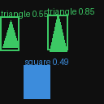
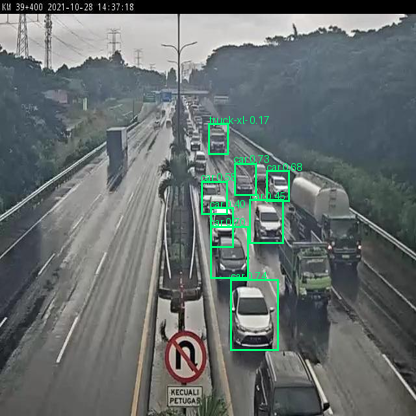

# DL_yolo — YOLOv2 스타일 객체 탐지기, PyTorch로 처음부터 구현

강의(딥러닝 코스4, Week3: Object Detection/YOLO)에서 다룬 **그리드 셀 + 앵커박스** 개념을
그대로 코드로 구현한 프로젝트입니다. 프레임워크의 `YOLO()` 한 줄 호출 없이, 데이터셋 →
모델 → 손실함수 → 학습 루프 → 추론/NMS까지 전 과정을 직접 작성했습니다.

두 개의 파이프라인이 같은 모델/손실함수/유틸리티 코드를 공유합니다.

- **synthetic**: 원/사각형/삼각형을 무작위로 그린 합성 데이터셋으로 빠르게 학습 루프 검증
- **vehicles**: Roboflow의 실제 차량 탐지 데이터셋(YOLOv8 포맷)에 그대로 연동

## 결과 예시

| 합성 데이터셋 | 차량 데이터셋 |
|---|---|
|  |  |

## 저장소 구조

```
.
├── model.py              # YoloV2Tiny: 작은 Darknet 스타일 백본 + 앵커박스 탐지 헤드
├── loss.py                # YOLO 손실함수 (localization + objectness + classification)
├── utils.py                # IoU, 앵커박스, GT→타겟 인코딩, 예측→박스 디코딩, NMS
│
├── dataset.py             # 합성(원/사각형/삼각형) 데이터셋
├── train.py                # 합성 데이터셋 학습 루프
├── inference.py            # 합성 데이터셋 추론 + 시각화
│
├── vehicles_config.py      # 차량 데이터셋 전용 설정 (입력 크기, 클래스, k-means 앵커)
├── vehicles_dataset.py     # Roboflow YOLOv8 txt 라벨 파서
├── train_vehicles.py       # 차량 데이터셋 학습 루프
├── inference_vehicles.py   # 차량 데이터셋 추론 + 시각화
├── vehicles_sample/        # 실 데이터셋 샘플 23장 (images/ + labels/)
│
├── test_utils.py            # utils.py 로직 검증 (encode → decode → NMS 라운드트립)
├── test_loss_numpy.py       # loss.py 계산을 numpy로 재현해 검증
├── test_vehicles.py         # 차량 데이터셋 버전 라운드트립 검증
│
├── checkpoints/             # 학습된 가중치 (yolo_tiny.pt, yolo_vehicles.pt)
└── outputs/                  # 추론 결과 시각화 이미지
```

## 설계 요약

- 입력: 128×128 RGB 이미지 (synthetic) / 416×416 (vehicles)
- 그리드: `S=8`, stride 16 (synthetic) / `S=26` (vehicles)
- 앵커: 5개, GT박스 중심이 속한 셀에서 **IoU(w,h 기준)가 가장 높은 앵커**를 책임 앵커로 선택 (YOLOv2 방식)
- 모델 출력: `(B, S, S, num_anchors, 5+num_classes)`
  - `tx, ty` : 셀 내 오프셋, `sigmoid` 적용 (0~1)
  - `tw, th` : 앵커 대비 log-space 배율 (raw)
  - `obj`    : objectness, `sigmoid` 적용 (0~1)
  - `class`  : raw logits (softmax/CE는 loss·decode 단계에서 처리)
- 손실(`loss.py`): 좌표/objectness는 제곱오차(SSE), 분류는 Cross-Entropy,
  `lambda_coord=5, lambda_obj=1, lambda_noobj=0.5, lambda_class=1`
- 추론(`inference.py`): sigmoid/softmax로 디코딩한 박스에 confidence threshold →
  클래스별 NMS(`iou_thresh=0.45`) 적용

## 시작하기

```bash
pip install torch pillow numpy
```

### 합성 데이터셋

```bash
# 모델 shape / 손실함수 sanity check
python model.py
python loss.py

# 학습 (합성 데이터셋 512장, 30 epoch)
python train.py --epochs 30 --batch-size 16

# 추론 (동봉된 checkpoints/yolo_tiny.pt 사용)
python inference.py --ckpt checkpoints/yolo_tiny.pt --seed 999 --out outputs/pred.png
```

### 차량 데이터셋

```bash
# Roboflow에서 받은 zip을 풀면 train/valid/test 폴더가 나옵니다 (각 폴더 안에 images/, labels/)

python train_vehicles.py --data-root /path/to/vehicles.v2-release.yolov8 --epochs 50

python inference_vehicles.py --ckpt checkpoints/yolo_vehicles.pt \
    --data-root /path/to/vehicles.v2-release.yolov8 --split test --index 0
```

동봉된 `vehicles_sample/`(실 데이터 23장)만으로도 데이터 파싱/인코딩 로직은 바로 확인할 수
있습니다:

```bash
python vehicles_dataset.py vehicles_sample
python test_vehicles.py
```

## 검증 상태

- `test_utils.py`, `test_loss_numpy.py`, `test_vehicles.py`: encode → decode → NMS
  라운드트립과 손실 계산 로직을 torch 없이 numpy로 재현해 검증 (모든 GT 박스가 좌표/클래스까지
  정확히 복원됨을 확인).
- `checkpoints/`, `outputs/`에 실제 학습된 가중치와 추론 결과 이미지가 포함되어 있어, 두
  파이프라인 모두 `train_*.py` → `inference_*.py`가 end-to-end로 동작함을 확인했습니다.

## 확장하기

- 실제 다른 데이터셋: `dataset.py`의 `YoloDataset`처럼 `__getitem__`이
  `(image_tensor(3,H,W), boxes(N,4) normalized cxcywh, labels(N,))`를 반환하도록 만들고
  `utils.encode_targets(boxes, labels)`를 그대로 재사용하면 됩니다. 물체 크기가 다르면
  `utils.ANCHORS`를 k-means로 다시 계산하는 것이 좋습니다 (YOLOv2 논문 방식, `vehicles_config.py` 참고).
- 차량 데이터셋은 클래스 불균형이 있습니다 (`car`가 전체 박스의 약 60%). 희귀 클래스 성능이
  아쉬우면 클래스 가중치나 오버샘플링을 추가하는 것을 권장합니다.
- 원본 이미지가 640×480(4:3)인데 416×416 정사각형으로 리사이즈해서 약간의 왜곡이 있습니다.
  letterbox padding(비율 유지 + 여백 패딩)으로 바꾸면 개선될 수 있습니다.
